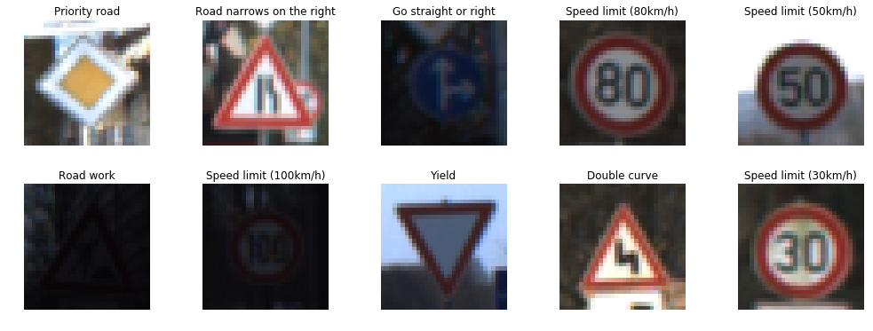
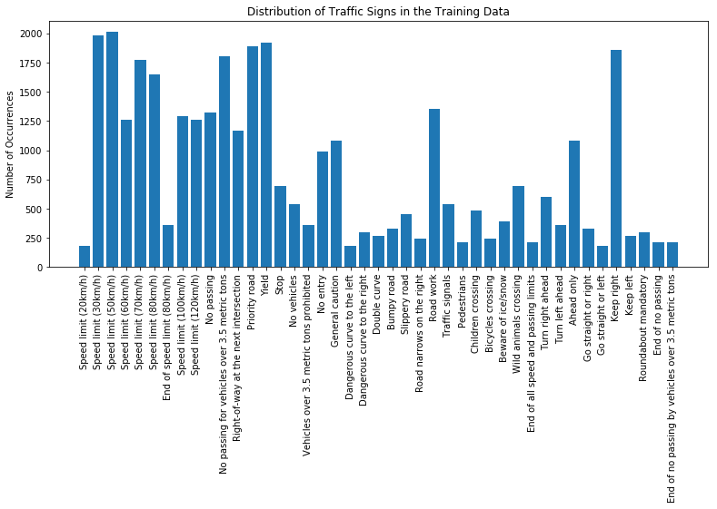
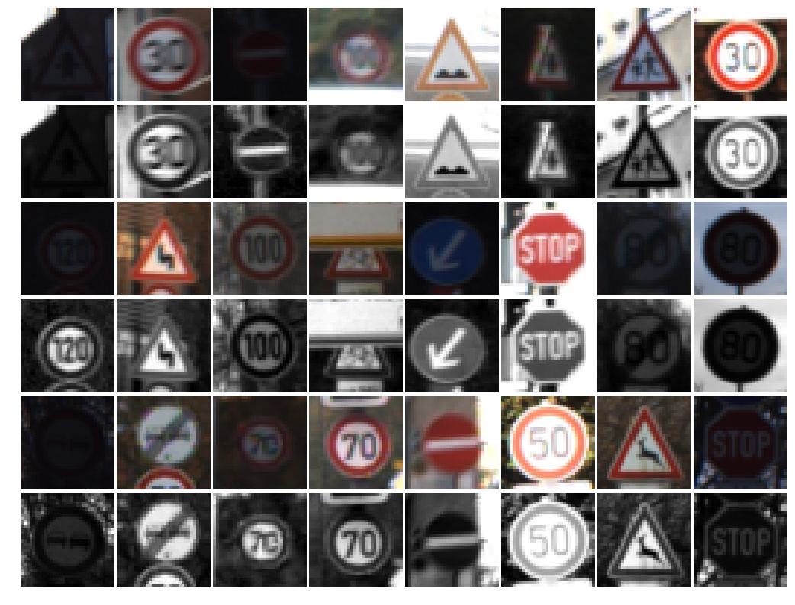

## Project: Build a Traffic Sign Recognition Program
[](http://www.udacity.com/drive)

Overview - Udacity Self Driving Car Term 1 Project 2

----------  

**Build a Traffic Sign Recognition Project**

The goals / steps of this project are the following:
* Load the data set (see below for links to the project data set)
* Explore, summarize and visualize the data set
* Design, train and test a model architecture
* Use the model to make predictions on new images
* Analyze the softmax probabilities of the new images
* Summarize the results with a written report


## Rubric Points
###Rubric points for the project are covered. [Rubric Points](https://review.udacity.com/#!/rubrics/481/view) individually and describe how I addressed each point in my implementation.  

####1. Provide a Writeup / README that includes all the rubric points and how you addressed each one. You can submit your writeup as markdown or pdf. You can use this template as a guide for writing the report. The submission includes the project code. 

This Readme covers the various rubric points and links to the code [project code](https://github.com/autosapien/CarND-Traffic-Sign-Classifier-Project)

###Data Set Summary & Exploration

####1. Provide a basic summary of the data set. In the code, the analysis should be done using python, numpy and/or pandas methods rather than hardcoding results manually.

The dataset provided has the training data, the validation set and a test set. These are loaded in numpy arrays and we see that they have the following properties: 


* The size of training set is 34799
* The size of the validation set is 4410
* The size of test set is 12630
* The shape of a traffic sign image is (32, 32, 3)
* The number of unique classes/labels in the data set is 43

####2. Include an exploratory visualization of the dataset.

Here are a few traffic signs that are part of the training dataset 

The dataset is not evenly distributed, we have uneven samples for different traffic signs 

The dataset could be augmented and balanced by adding images by shearing, blurring, rotating (some signs) and flipping (some signs).
This would improve the training to a alrge extent. We did not do this as we achieved a 95% + accuracy in validation and testing.

###Design and Test a Model Architecture

####1. Describe how you preprocessed the image data. What techniques were chosen and why did you choose these techniques? Consider including images showing the output of each preprocessing technique. Pre-processing refers to techniques such as converting to grayscale, normalization, etc. (OPTIONAL: As described in the "Stand Out Suggestions" part of the rubric, if you generated additional data for training, describe why you decided to generate additional data, how you generated the data, and provide example images of the additional data. Then describe the characteristics of the augmented training set like number of images in the set, number of images for each class, etc.)

As a first step, The images are convered to grayscale. We follow the guidance from the original Yann Lecun article. The original [paper](http://yann.lecun.com/exdb/publis/pdf/sermanet-ijcnn-11.pdf) from Lecun makes a point stating that greyscale image yield better results.

Here is some traffic sign images before and after grayscaling. 

The images are normalized to that each element is now within the interval \[-1, 1\]
```
X_train = np.divide(np.add(X_train_grey, -128), 128)
X_valid = np.divide(np.add(X_valid_grey, -128), 128)
X_test = np.divide(np.add(X_test_grey, -128), 128)

```

####2. Describe what your final model architecture looks like including model type, layers, layer sizes, connectivity, etc.) Consider including a diagram and/or table describing the final model.

We follow up on the LeNet architecture, additionally we add two dropout layers to prevent the network from overfitting. The network looks like:

| Layer         		|     Description	        					| 
|:---------------------:|:---------------------------------------------:| 
| Input         		| 32x32x1 Greyscale image   					| 
| Convolution 5x5x6    	| 1x1 stride, valid padding, outputs 28x28x6 	|
| RELU					|												|
| Max pooling	      	| 2x2 stride, outputs 14x14x6 			    	|
| Convolution  5x5x16   | 1x1 stride, valid padding, outputs 10x10x16   |
| RELU					|												|
| Max pooling	        | 2x2 stride, outputs 5x5x16 		            |
| Dropout				| keep prob 0.55								|
| Flatten	         	| 5x5x16 to 400                                 |
| Fully connected		| 400 to 128      								|
| RELU					|												|
| Dropout				| keep prob 0.55								|
| Fully connected		| 400 to 128      								|
| RELU					|												|
| Fully connected		| 128 to 86      								|
| RELU					|												|
| Fully connected		| 86 to 43      								|

####3. Describe how you trained your model. The discussion can include the type of optimizer, the batch size, number of epochs and any hyperparameters such as learning rate.

The LeNet example is taken as a starting point. In addition 2 dropout layers are added. We use the following hyperparameters:
```
EPOCHS = 40 
BATCH_SIZE = 128
rate = 0.001
dropout_keep_prob = 0.55
```

A greater number of epochs are used (40 instead of 20) as the dropouts prevent certain neurons from getting trained in each cycle. We used the AdamOptimizer in place of gradient descent this has shown to be better for such problems.

####4. Describe the approach taken for finding a solution and getting the validation set accuracy to be at least 0.93. Include in the discussion the results on the training, validation and test sets and where in the code these were calculated. Your approach may have been an iterative process, in which case, outline the steps you took to get to the final solution and why you chose those steps. Perhaps your solution involved an already well known implementation or architecture. In this case, discuss why you think the architecture is suitable for the current problem.

1. We started with a simplified model of [Pierre Sermanet and Yann LeCun](http://yann.lecun.com/exdb/publis/pdf/sermanet-ijcnn-11.pdf). The subsampling is replaced by maxpooling and we do not use any branching. 
2. Improved by moving to data to greyscale and normalizing the images
3. Added a dropout layer to improve test accuracy
4. Tuned the Fully connected layers by changing their sizes
5. Added another dropout layer to improve test accuracy
6. Reduced the dropout keep probability for even better performance
7. Played with the learning rate and epochs, as the drop out is quite substantial used higher epoch values
8. Happy with the accuracy of 95.4 for validation and testing
9. Applying transforms to the training dataset could provide a large boost to the accuracy. This can be taken up a later date. 

My final model results were:
* training set accuracy of 0.996
* validation set accuracy of 0.959 
* test set accuracy of 0.952

Based on the above results we see that there is minor overfitting. Using a larger and more balanced dataset this overfitting can be reduced. 

###Test a Model on New Images

####1. Choose five German traffic signs found on the web and provide them in the report. For each image, discuss what quality or qualities might be difficult to classify.

Here are some German traffic signs that I found on the web:


These images look straightforward to classify. All the images have the traffic signs that are fully visible i.e. there is not artifact covering any part of the image. The images all appear to have been taken front on with limited shearing, in addition they have limited rotation. These qualities should help with correct identification, our classifier should be able to classify these correctly. Let us test is out!!

####2. Discuss the model's predictions on these new traffic signs and compare the results to predicting on the test set. At a minimum, discuss what the predictions were, the accuracy on these new predictions, and compare the accuracy to the accuracy on the test set (OPTIONAL: Discuss the results in more detail as described in the "Stand Out Suggestions" part of the rubric).

On running the classifier we get the expected result
```
Real Labels:  [17 11 14 25 12 34  3 14]
Predicted Labels:  [17 11 14 25 12 34  3 14]
```


The model was able to correctly guess 8 of the 8 traffic signs, which gives an accuracy of 100%. This compares favorably to the accuracy on the test set as these images are clear with good contrast.

####3. Describe how certain the model is when predicting on each of the five new images by looking at the softmax probabilities for each prediction. Provide the top 5 softmax probabilities for each image along with the sign type of each probability. (OPTIONAL: as described in the "Stand Out Suggestions" part of the rubric, visualizations can also be provided such as bar charts)

We compute the softmax probabilities of the top 5 predictions for each image. These are


The softmax probability of the topmost prediction of almost all the images are close to 100%. Image 3 (Stop Sign) looks interesting as the probability for the correct classification is not as high as one would expect. This is probably because the stop sign in the picture almost fills the image (training set seems to have images that are more spaced out where the traffic sign occupies a smaller part of the image)
  
###Improvements

1. As mentioned earlier we should augment and balance our training data
2. We could enhance the image a litte by increasing contrast
3. We could lower the training rate and dropout keep probability and increase the epochs


